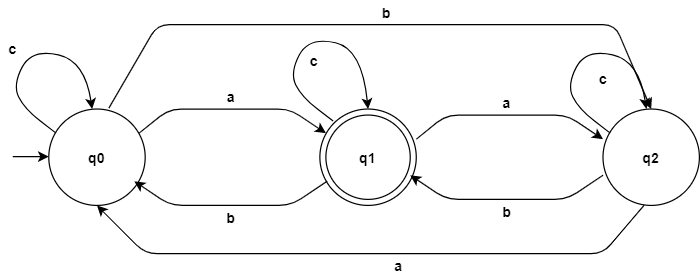
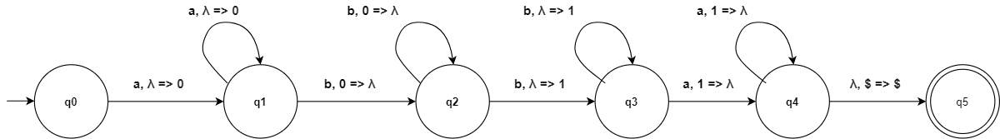

# TLA Project
Implementing different kinds of automatons(FA, PDA, TM) for 5 given languages.
The code is commented and there is a description down below for how to test the languages.
For every method, there is a brief description about how it works and the parameters and what it returns.

## Languages
#### First Language
    𝐿 = {𝑤 | 𝑤 ε {𝑎,𝑏,𝑐}∗, len(w) % 2 == 0}

#### Second Language
    𝐿 = {𝑤 | 𝑤 ε {𝑎,𝑏,𝑐}∗, (𝑛𝑎(𝑤)− 𝑛𝑏(𝑤) % 3 == 1}

#### Third Language
    𝐿 = {𝑤𝑐𝑤^𝑟 | 𝑤 ε {𝑎,𝑏}∗}

#### Fourth Language
    𝐿 = {𝑎^𝑛 𝑏^(𝑛+𝑚) 𝑎^𝑚 | 𝑚,𝑛 ≥ 1}

#### Fifth Language
    𝐿 = { 𝑤𝑤 | 𝑤 ε {𝑎,𝑏,𝑐}∗}

### Description
For every language there's a l#.py file which you can run and test the automaton constructed for that language.
In each file you are asked to enter an arbitrary string. 
If the string you've entered is accepted by the automaton it will show you the transitions.

### Examples

The First Language:
    
    input: abba
    output:
    String 'abba' is accepted by this language and the transitions are:
    -> q0 => q1 => q0 => q1 => q0 
    
    input: aba
    output:
    String 'aba' is not accepted by this language!
    
The Second Language:
    
    input: caab
    output:
    String 'caab' is accepted by this language and the transitions are:
    -> q0 => q0 => q1 => q2 => q1
    
    input: caa
    output:
    String 'caa' is not accepted by this language!

The Third Language:
    
    input: aca
    output:
    String 'aca' is accepted by this language and the transitions are:
    -> (q0 ['$']) => (q0 ['$', '0']) => (q1 ['$', '0']) => (q1 ['$']) => (q2 ['$'])
    
    input: aa
    output:
    String 'aa' is not accepted by this language!

The Fourth Language:
    
    input: abba
    output:
    String 'abba' is accepted by this language and the transitions are:
    -> (q0 ['$']) => (q1 ['$', '0']) => (q2 ['$']) => (q3 ['$', '1']) => (q4 ['$']) => (q5 ['$'])
    
    input: cca
    output:
    String 'cca' is not accepted by this language!